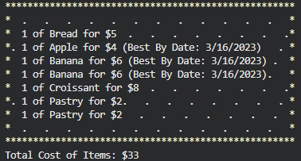

# Pierre's Bakery

## An interactive bakery with discounted treats!

Console app in C# that uses a command system to inform the user of available goods and prices, as well as allow the user to add goods to their cart.

# Technologies Used:
* C#
* MSTest Unit Testing

# Installation / Setup:

1. Clone this repository
2. Navigate to the PierresBakery.Solution folder in a terminal.
3. `cd` into /PierresBakery folder.
4. Type `dotnet run` and press enter.
5. Enjoy!

## Optional: Testing Instructions:

1. Navigate into PierresBakery.Solution folder in a terminal.
2. `cd` into /PierresBakery.Tests folder.
3. Type `dotnet restore` to install all dependencies.
4. Once dependencies are installed, type `dotnet test` and press enter.

# Contact Information

Please contact me at jack@netbug.us to report bugs or ask questions!

# License:

The MIT License (MIT)
Copyright © 2023 Jackson Levine

Permission is hereby granted, free of charge, to any person obtaining a copy of this software and associated documentation files (the “Software”), to deal in the Software without restriction, including without limitation the rights to use, copy, modify, merge, publish, distribute, sublicense, and/or sell copies of the Software, and to permit persons to whom the Software is furnished to do so, subject to the following conditions:

The above copyright notice and this permission notice shall be included in all copies or substantial portions of the Software.

THE SOFTWARE IS PROVIDED “AS IS”, WITHOUT WARRANTY OF ANY KIND, EXPRESS OR IMPLIED, INCLUDING BUT NOT LIMITED TO THE WARRANTIES OF MERCHANTABILITY, FITNESS FOR A PARTICULAR PURPOSE AND NONINFRINGEMENT. IN NO EVENT SHALL THE AUTHORS OR COPYRIGHT HOLDERS BE LIABLE FOR ANY CLAIM, DAMAGES OR OTHER LIABILITY, WHETHER IN AN ACTION OF CONTRACT, TORT OR OTHERWISE, ARISING FROM, OUT OF OR IN CONNECTION WITH THE SOFTWARE OR THE USE OR OTHER DEALINGS IN THE SOFTWARE.

